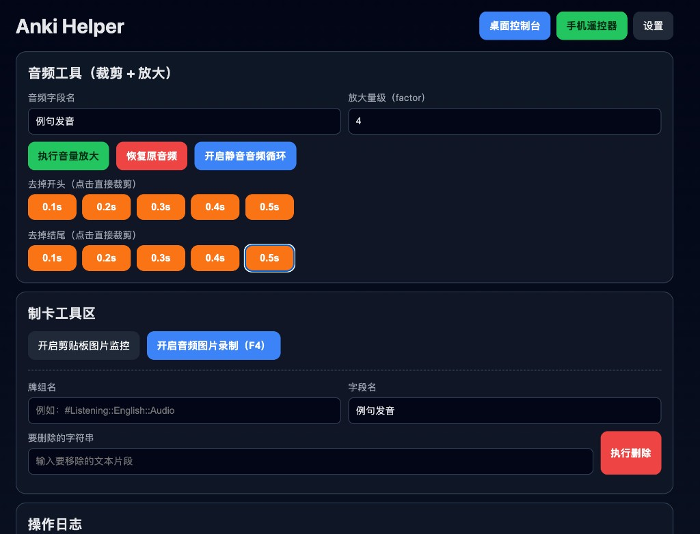

# Anki Helper



## 中文

本项目是一个本地 Web 工具，用于提高 Anki 复习和制卡效率。

### 当前功能
- **桌面控制台**
  - 音频处理：放大、恢复、快捷裁剪（去头/去尾 `0.1s`~`0.5s`）
  - 静音循环播放开关（用于蓝牙音频节点唤醒）
  - 制卡工具区：
    - 剪贴板图片监控开关（检测到新图片后写入最近添加卡片）
    - 音频图片录制开关（开启后按 `F4`：截图 + 录音 + 更新最近添加卡片）
    - 批量字段清理（按牌组 + 字段，删除指定字符串）
- **手机遥控器**
  - `重来` / `困难` / `回放` / `翻面` / `撤销`
  - 其中 `回放` 会触发截图和录音并写入最近添加卡片
- **设置页面**
  - 支持自动保存
  - 同步时间使用易懂格式（如 `19:30`），内部自动换算为 cron

### 运行
```bash
npm install
npm run start:web
```

- 本地地址：`http://localhost:3333`
- 手机遥控：`http://<你的局域网IP>:3333/?mode=remote`

### 打包可执行文件
```bash
npm run build:mac
npm run build:win
# 或
npm run build:all
```

产物目录：`dist/`

### 配置文件
- 默认配置：`app_default_setting.json`（模板，不变更）
- 生效配置：`app_settings.json`（创建后以它为准）

---

## English

Anki Helper is a local web app for faster Anki review and card-creation workflows.

### Current Features
- **Desktop Console**
  - Audio tools: amplify, restore, quick trim (`0.1s`~`0.5s`)
  - Silent-audio loop toggle (Bluetooth audio route warm-up)
  - Card-making tools:
    - Clipboard image monitor (auto update latest added note)
    - Audio+image capture toggle (`F4` after enabled: screenshot + recording + update latest note)
    - Bulk field cleanup (remove substring by deck + field)
- **Mobile Remote**
  - `Again` / `Hard` / `Replay` / `Flip` / `Undo`
  - `Replay` triggers screenshot+recording and updates the latest added note
- **Settings**
  - Auto-save enabled
  - Sync time in friendly format (e.g. `19:30`) with internal cron conversion

### Run
```bash
npm install
npm run start:web
```

- Local URL: `http://localhost:3333`
- Mobile remote: `http://<your-lan-ip>:3333/?mode=remote`

### Build Executables
```bash
npm run build:mac
npm run build:win
# or
npm run build:all
```

Output: `dist/`
